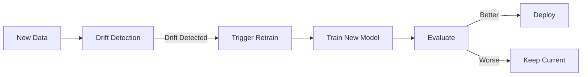

# MLOps SageMaker Template

End-to-end MLOps lifecycle template using AWS SageMaker with GitLab CI/CD, featuring autoscaling, rollback, and automated retraining.

## 🏗️ Architecture

```
┌─────────────────────────────────────────────────────────────────────┐
│                         GitLab CI/CD Pipeline                       │
├─────────┬─────────┬──────────┬──────────┬────────────┬─────────────┤
│ Validate│  Train  │ Evaluate │ Register │   Deploy   │   Monitor   │
└────┬────┴────┬────┴────┬─────┴────┬─────┴─────┬──────┴──────┬──────┘
     │         │         │          │           │             │
     ▼         ▼         ▼          ▼           ▼             ▼
┌─────────────────────────────────────────────────────────────────────┐
│                          AWS SageMaker                               │
│  ┌─────────┐ ┌──────────┐ ┌────────────┐ ┌───────────┐ ┌─────────┐ │
│  │   S3    │ │ Pipeline │ │  Registry  │ │ Endpoint  │ │ Monitor │ │
│  │  Data   │ │ Training │ │   Models   │ │ Inference │ │ Metrics │ │
│  └─────────┘ └──────────┘ └────────────┘ └───────────┘ └─────────┘ │
└─────────────────────────────────────────────────────────────────────┘
```

## 📁 Project Structure

```
mlops-sagemaker/
├── .gitlab-ci.yml              # Main CI/CD pipeline
├── config/                     # Configuration files
│   ├── training_config.yaml    # Training hyperparameters
│   ├── deployment_config.yaml  # Deployment settings
│   └── autoscaling_config.yaml # Autoscaling policies
├── src/
│   ├── training/               # Training components
│   ├── inference/              # Inference handler
│   └── pipelines/              # SageMaker pipelines
├── scripts/                    # Deployment & utility scripts
├── tests/                      # Unit & integration tests
└── monitoring/                 # CloudWatch configs
```

## 🚀 Quick Start

### Prerequisites

- AWS Account with SageMaker access
- GitLab account with CI/CD enabled
- Python 3.9+
- AWS CLI configured

### Setup

1. **Clone and configure:**
   ```bash
   git clone <repository-url>
   cd mlops-sagemaker
   pip install -r requirements.txt
   ```

2. **Configure GitLab CI/CD Variables:**
   - `AWS_ACCESS_KEY_ID` - AWS access key
   - `AWS_SECRET_ACCESS_KEY` - AWS secret key
   - `AWS_DEFAULT_REGION` - AWS region (e.g., `us-east-1`)
   - `SAGEMAKER_EXECUTION_ROLE` - SageMaker execution role ARN
   - `S3_BUCKET` - S3 bucket for artifacts

3. **Update configurations:**
   ```bash
   # Edit config files with your settings
   vim config/training_config.yaml
   vim config/deployment_config.yaml
   ```

4. **Push to trigger pipeline:**
   ```bash
   git add .
   git commit -m "Initial MLOps setup"
   git push origin main
   ```

## 🔄 CI/CD Pipeline Stages

| Stage | Description | Trigger |
|-------|-------------|---------|
| **validate** | Lint, test, validate configs | Every push |
| **train** | Execute SageMaker training job | On main/develop |
| **evaluate** | Model evaluation with quality gates | After training |
| **register** | Register model in SageMaker Registry | If evaluation passes |
| **deploy-staging** | Deploy to staging endpoint | After registration |
| **deploy-production** | Blue-green production deployment | Manual trigger |
| **rollback** | Rollback to previous version | Manual trigger |

## 📊 Autoscaling Configuration

The template includes three autoscaling strategies:

- **Target Tracking**: Scale based on invocations per instance
- **Step Scaling**: Scale based on CPU/memory thresholds
- **Scheduled Scaling**: Time-based scaling for predictable traffic

```yaml
# config/autoscaling_config.yaml
target_tracking:
  target_value: 1000  # invocations per instance
  scale_in_cooldown: 300
  scale_out_cooldown: 60
```

## 🔁 Rollback

Rollback can be triggered:

1. **Manually via GitLab:**
   - Go to CI/CD > Pipelines
   - Click "rollback" job

2. **Via CLI:**
   ```bash
   python scripts/rollback_endpoint.py --endpoint-name my-endpoint --version previous
   ```

3. **Automatic rollback:** On CloudWatch alarm trigger

## 🔄 Retraining Pipeline

Automated retraining is triggered by:

- **Schedule**: Weekly/monthly via EventBridge
- **Data Drift**: When feature distributions change significantly
- **Performance Degradation**: When model metrics drop below threshold



## 🔐 Security Best Practices

- Use IAM roles with least privilege
- Store secrets in GitLab CI/CD variables or AWS Secrets Manager
- Enable VPC endpoints for SageMaker
- Encrypt data at rest (S3, EBS) and in transit (TLS)
- Enable CloudTrail for audit logging

## 📈 Monitoring

### Key Metrics
- Endpoint latency (p50, p95, p99)
- Invocation count and errors
- CPU/Memory utilization
- Model prediction quality

### Alerts
- High latency (>500ms p95)
- Error rate >1%
- Instance count at max
- Data drift detected

## 🛠️ Development

```bash
# Install dev dependencies
pip install -r requirements-dev.txt

# Run tests
pytest tests/ -v

# Lint code
flake8 src/ scripts/
black src/ scripts/ --check

# Local pipeline test
python src/pipelines/training_pipeline.py --local-test
```

## 📚 Additional Resources

- [AWS SageMaker Developer Guide](https://docs.aws.amazon.com/sagemaker/)
- [GitLab CI/CD Documentation](https://docs.gitlab.com/ee/ci/)
- [SageMaker Python SDK](https://sagemaker.readthedocs.io/)

## 📄 License

MIT License - see [LICENSE](LICENSE) for details.
